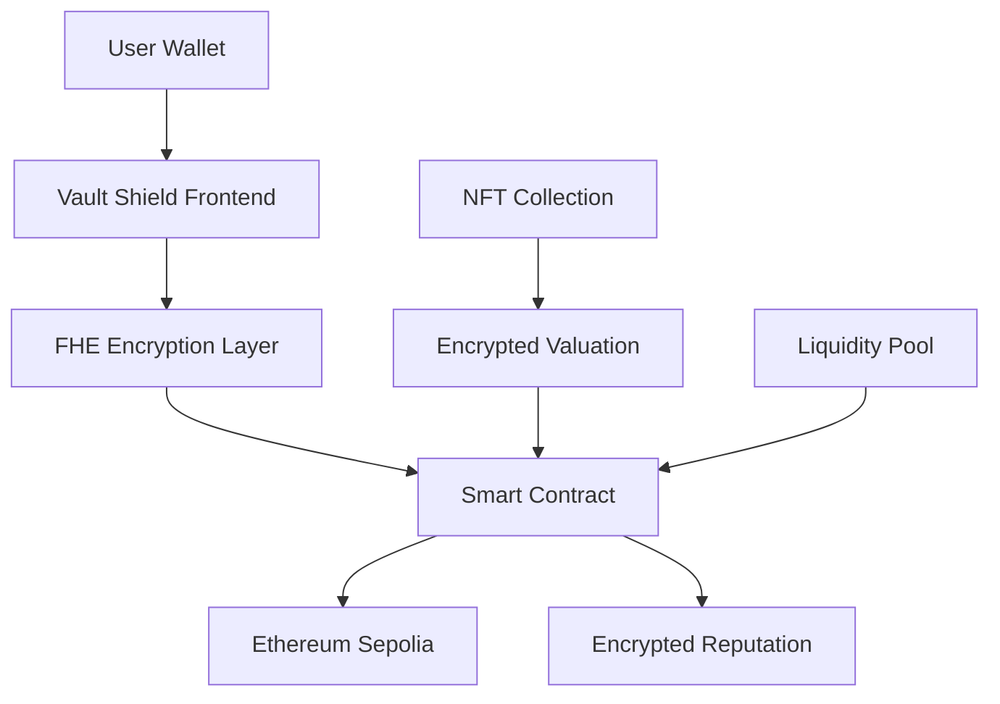

<div align="center">

# 🛡️ Vault Shield

**The Future of Private NFT Lending**

[](https://opensource.org/licenses/MIT)
[](https://www.typescriptlang.org/)
[](https://reactjs.org/)
[](https://vitejs.dev/)

*Unlock liquidity from your NFTs without revealing their value*

</div>

---

## 🚀 What is Vault Shield?

Vault Shield revolutionizes NFT lending by implementing **Fully Homomorphic Encryption (FHE)** to protect your digital assets' true value. Unlike traditional platforms that expose collateral values, we ensure complete privacy while maintaining competitive lending rates.

### 🎯 Core Innovation

- **🔒 Zero-Knowledge Collateralization**: Your NFT values remain encrypted throughout the entire lending process
- **⚡ Instant Liquidity**: Access funds against your NFTs without market impact
- **🛡️ Anti-Manipulation**: Prevent price manipulation through confidential lending
- **🌐 Multi-Chain Ready**: Built for the future of cross-chain DeFi

## ✨ Key Features

| Feature | Description | Benefit |
|---------|-------------|---------|
| **FHE Encryption** | All financial data encrypted on-chain | Complete privacy protection |
| **Smart Liquidation** | Automated risk management | Reduced liquidation risk |
| **Reputation System** | Encrypted credit scoring | Better rates for good borrowers |
| **Multi-Wallet** | Support for all major wallets | Seamless user experience |

## 🏗️ Architecture



## 🛠️ Tech Stack

### Frontend
- **React 18** - Modern UI framework
- **TypeScript** - Type-safe development
- **Vite** - Lightning-fast build tool
- **Tailwind CSS** - Utility-first styling
- **shadcn/ui** - Beautiful component library

### Web3 Integration
- **RainbowKit** - Wallet connection made simple
- **Wagmi** - React hooks for Ethereum
- **Viem** - TypeScript interface for Ethereum

### Blockchain
- **Ethereum Sepolia** - Testnet deployment
- **Solidity** - Smart contract language
- **FHE** - Privacy-preserving computations

## 🚀 Quick Start

### Prerequisites

- **Node.js** 18+ and npm
- **Git** for version control
- **Web3 Wallet** (MetaMask, WalletConnect, etc.)

### Installation

```bash
# 1. Clone the repository
git clone https://github.com/your-username/vault-shield.git
cd vault-shield

# 2. Install dependencies
npm install

# 3. Set up environment variables
cp .env.example .env.local

# 4. Start development server
npm run dev
```

### Environment Configuration

Create a `.env.local` file with your configuration:

```env
# Blockchain Configuration
NEXT_PUBLIC_CHAIN_ID=11155111
NEXT_PUBLIC_RPC_URL=https://sepolia.infura.io/v3/YOUR_INFURA_KEY

# Wallet Integration
NEXT_PUBLIC_WALLET_CONNECT_PROJECT_ID=YOUR_WALLET_CONNECT_PROJECT_ID

# Optional: Additional RPC endpoints
NEXT_PUBLIC_INFURA_API_KEY=YOUR_INFURA_KEY
```

> **Note**: Replace placeholder values with your actual API keys for production use.

## 🔐 Smart Contract Architecture

Our VaultShield smart contract leverages **Fully Homomorphic Encryption** to ensure complete privacy:

### Core Features

| Component | Description | Privacy Level |
|-----------|-------------|---------------|
| **Encrypted Values** | NFT token IDs, collateral values, loan amounts | 🔒 Fully Encrypted |
| **Reputation System** | Borrower and lender credit scores | 🔒 Fully Encrypted |
| **Liquidation Logic** | Automated risk management | 🔒 Fully Encrypted |
| **Interest Calculations** | Dynamic rate computation | 🔒 Fully Encrypted |

### Contract Functions

```solidity
// Core Functions
createVault()     // Create encrypted NFT vault
requestLoan()     // Request loan against vault
makeRepayment()   // Process encrypted repayments
liquidateVault()  // Automated liquidation system
```

## 🚀 Deployment

### Vercel (Recommended)

1. **Connect Repository**: Link your GitHub repo to Vercel
2. **Configure Environment**: Set up environment variables
3. **Deploy**: Automatic deployment on every push

### Environment Variables

```env
# Required for Production
NEXT_PUBLIC_CHAIN_ID=11155111
NEXT_PUBLIC_RPC_URL=https://sepolia.infura.io/v3/YOUR_INFURA_KEY
NEXT_PUBLIC_WALLET_CONNECT_PROJECT_ID=YOUR_WALLET_CONNECT_PROJECT_ID

# Optional
NEXT_PUBLIC_INFURA_API_KEY=YOUR_INFURA_KEY
```

### Manual Deployment

```bash
# Build for production
npm run build

# Deploy to your preferred platform
npm run preview
```

## 🤝 Contributing

We welcome contributions! Here's how to get started:

```bash
# 1. Fork the repository
git clone https://github.com/your-username/vault-shield.git

# 2. Create feature branch
git checkout -b feature/your-amazing-feature

# 3. Make your changes
git add .
git commit -m "Add your amazing feature"

# 4. Push and create PR
git push origin feature/your-amazing-feature
```

### Development Guidelines

- **Code Style**: Follow TypeScript best practices
- **Testing**: Add tests for new features
- **Documentation**: Update docs for API changes
- **Security**: Review FHE implementation carefully

## 🔒 Security & Privacy

### Privacy-First Design

- **FHE Encryption**: All sensitive data encrypted on-chain
- **Zero-Knowledge**: No value exposure during operations
- **Audit Ready**: Open source for community review

### Security Measures

- Smart contract audits (planned)
- Multi-signature wallet support
- Emergency pause functionality
- Liquidation protection mechanisms

## 📈 Roadmap

### Phase 1: Foundation ✅
- [x] Core FHE implementation
- [x] Basic lending functionality
- [x] Multi-wallet support

### Phase 2: Enhancement 🚧
- [ ] Advanced analytics dashboard
- [ ] Mobile application
- [ ] Additional NFT collections

### Phase 3: Scale 🌐
- [ ] Mainnet deployment
- [ ] Cross-chain compatibility
- [ ] Institutional features

## 📄 License

This project is licensed under the **MIT License** - see the [LICENSE](LICENSE) file for details.

## 💬 Community & Support

- **Discord**: Join our community discussions
- **GitHub Issues**: Report bugs and request features
- **Documentation**: Comprehensive guides and API docs

---

<div align="center">

**Built with ❤️ for the future of private DeFi**

[⭐ Star this repo](https://github.com/your-username/vault-shield) • [🐛 Report Bug](https://github.com/your-username/vault-shield/issues) • [💡 Request Feature](https://github.com/your-username/vault-shield/issues)

</div>
